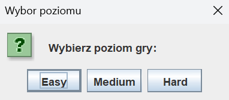
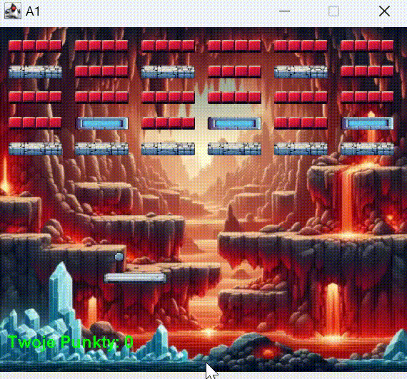

# Arkanoid Game

## Overview

Arkanoid is a classic brick-breaking game where the player controls a paddle to bounce a ball and destroy bricks on the screen. The objective is to clear all the bricks while scoring points and avoiding penalties.

## Table of Contents

- [Platform and Controls](#platform-and-controls)
- [Game Objectives](#game-objectives)
- [Levels](#levels)
- [Bonuses and Traps](#bonuses-and-traps)
- [End Game Rules](#end-game-rules)
- [User Interface](#user-interface)
- [Graphics and Sound](#graphics-and-sound)
- [Technical Solutions](#technical-solutions)
- [Project Description](#project-description)
- [How It Looks](#how-it-looks)

## Platform and Controls

- **Platform:** PC
- **Controls:** The paddle is controlled using the mouse.

## Game Objectives

- **Primary Goal:** Destroy all the bricks on the screen using the ball bounced by the paddle.
- **Secondary Goal:** Catch bonuses to increase points.
- **Scoring:** Points are awarded for each brick destroyed.

## Levels

- The game consists of multiple levels with varying brick layouts.
- Bricks come in different types with varying "hardness."
- Levels increase in difficulty, introducing new elements as the player progresses.

## Bonuses and Traps

- **Bonus:** Adds 100 points when caught.
- **Trap:** Deducts 50 points when caught.

## End Game Rules

- The game has two possible endings:
  - **Positive End:** Destroy all bricks with a positive score.
  - **Negative End:** Lose the ball without catching it with the paddle or end with a negative score after clearing all bricks.

## User Interface

- The interface is intuitive and easy to navigate, allowing players to focus on gameplay.
- Current score is clearly displayed on the screen.
- Levels are easy to understand, with brick layouts and backgrounds reflecting increasing difficulty.
- Color schemes and sounds provide hints about the effects of bonuses and traps without being explicit.

## Graphics and Sound

- **Graphics:** The game features attractive and pleasant graphics.
- **Animations:** Smooth animations enhance the gaming experience.
- **Sound:** Appropriate sound effects and music tailored to the level of difficulty.

## Technical Solutions

The game is implemented using the following Java libraries and packages:

1. **javax.swing:** For creating the game window, handling keyboard and mouse events, and rendering graphics.
2. **java.awt.event:** For managing user actions such as key presses and mouse movements.
3. **java.awt:** For drawing basic graphical elements like the paddle, ball, and bricks.
4. **java.awt.geom:** For precise manipulation of geometric objects, essential for movement and collision detection.
5. **java.util.ArrayList:** For storing and managing game objects like bricks.
6. **javax.sound.sampled:** For implementing sound effects such as ball bounces, brick destruction, and bonuses.
7. **java.util.Timer and java.util.TimerTask:** For managing game timing, such as the lifespan of special items.
8. **java.io.File and java.io.IOException:** For handling file operations, useful for loading game resources like sound files.

## Project Description

The game involves controlling a paddle at the bottom of the screen to bounce a ball and destroy bricks. The primary goal is to clear all bricks while precisely controlling the paddle with the mouse. Additionally, players can earn points by catching bonus that appear during gameplay. However, players must also avoid trap that can deduct points.

The game features multiple levels with varying brick layouts, each introducing new challenges and elements. Bricks come in different types, requiring strategic approaches to destroy them. The game has two possible **endings**: a **positive** end when all bricks are destroyed with a positive score, and a **negative** end if the ball is lost without catching or if the final score is negative after clearing all bricks.

The user interface is designed to be intuitive and user-friendly, displaying the current score clearly and ensuring that levels are easy to understand. Sound effects and music enhance the gameplay experience, with the music adapting to the difficulty level.

## How It Looks

  

  

